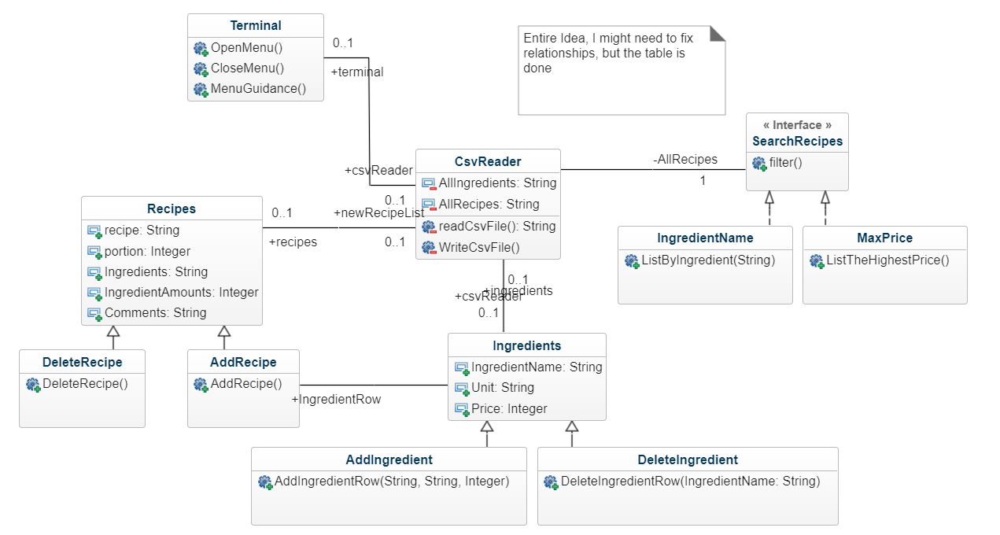

## Online recipe book design
This document will describe the design for assigment 4, the goal is to start the program, read 2 csv files[ingredients and recipes] from there since all names will be unique we can obtain their unique index from an arrayList and then just add the index + 1 and + 2 for the instance of ingredients.
for example

´´´ java
  
    function find ingredients() {
    ArrayList<String> ingredients = new ArrayList<String>;
      String a = "Milk";
      String b = "Litre";
      String c = "10";
      String d = "Egg";
  
      ingredients.add(a);
      ingredients.add(b);
      ingredients.add(c);
      ingredients.add(d);
      if(ingredients.contains("Milk")) {
        Integer l = ingredients.indexOf("Milk");
        System.out.println("Name: "+ ingredients.get(l));
        System.out.println("Unit: "+ ingredients.get(l + 1));
        System.out.println("Price: "+ ingredients.get(l + 2));
      }
    }
´´´

Same can be done for an instance for adding and deleting

...

## Menu
When the program starts, the ingredients and recipes csv files will be read and the following menu will show up
Select from the menu
(1) Ingredients
(2) Recipes

The ingredients sub-section will contain:
(1) add Ingredient (needs: name, Unit, Price)
(2) List all ingredients
(3) Search specific ingredient
(4) Delete ingredient

The Recipes sub-section will contain:
(1) Add recipe, (needs: name, portion, ingredients, ingredient amounts and comments) 
(2) List all recipes
(3) Search a specific recipe ( needs: name, portion)
(4) Delete recipe
(5) Search recipes with filters (by ingredient name or maximum price)

Then Use the strategy patten in order to create the search table

Continue later ...

## class diagram 

